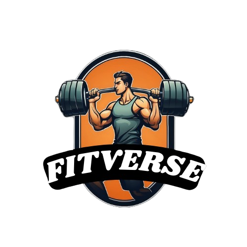

# Fitverse - Finish Your Sets



Fitverse is a fitness landing page designed to promote the Fitverse fitness center. This landing page is crafted with HTML and CSS, providing an engaging and responsive web experience.

## Table of Contents

- [Overview](#overview)
- [Features](#features)
- [Getting Started](#getting-started)
- [Usage](#usage)
- [Contributing](#contributing)
- [License](#license)

## Overview

The Fitverse landing page is designed to attract users interested in fitness programs offered by Fitverse. It showcases various sections, including program exploration, class details, membership benefits, pricing plans, and user testimonials. The goal is to encourage users to explore and engage with Fitverse.

## Features

- **Responsive Design:** The landing page is optimized for a seamless experience across various devices, ensuring a consistent and visually appealing presentation.

- **Interactive Navigation:** Users can easily navigate through different sections using the intuitive navigation menu, enhancing user engagement.

- **Engaging Sections:** Fitverse highlights key features such as strength programs, physical fitness, fat loss, weight gain, and more, providing detailed information for users.

- **Call-to-Action Elements:** Prominent call-to-action buttons guide users to take specific actions, like joining Fitverse or booking a class.

## Getting Started

To view the Fitverse landing page locally, follow these steps:

1. Clone the repository:

   ```bash
   git clone https://github.com/Rajatt072779/FitVerse.git
   ```

2. Open the `index.html` file in your preferred web browser.

## Usage

Feel free to use this landing page as a template for your fitness-related projects. Customize the content, colors, and images to align with your brand or concept.

## Contributing

Contributions are welcome! If you have ideas for improvements or new features, please create an issue or submit a pull request.

## License

This project is licensed under the [MIT License](LICENSE).

---
